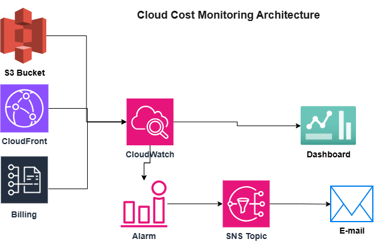
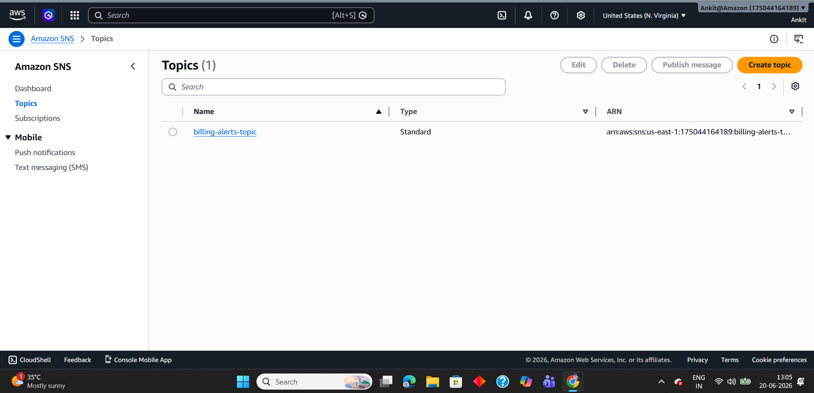
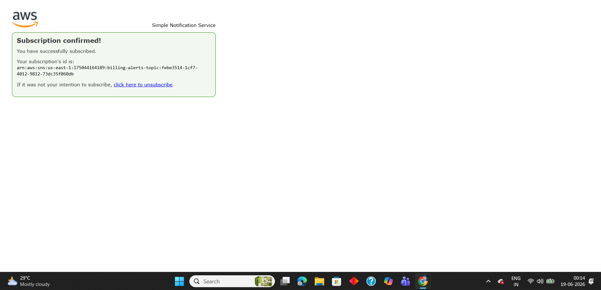
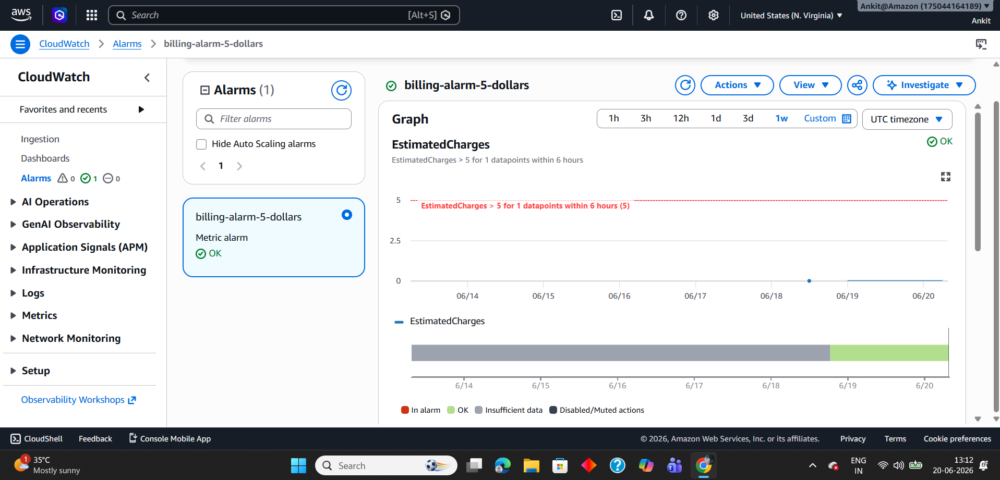
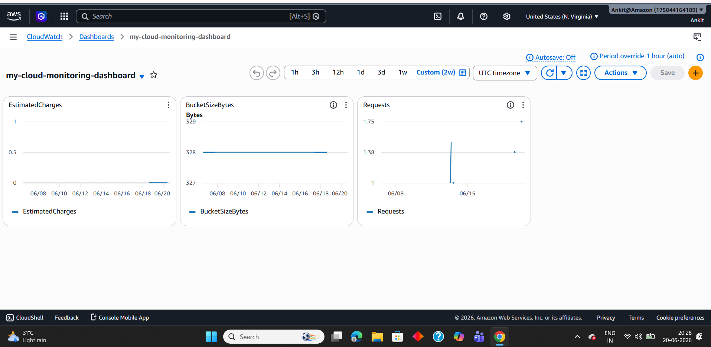
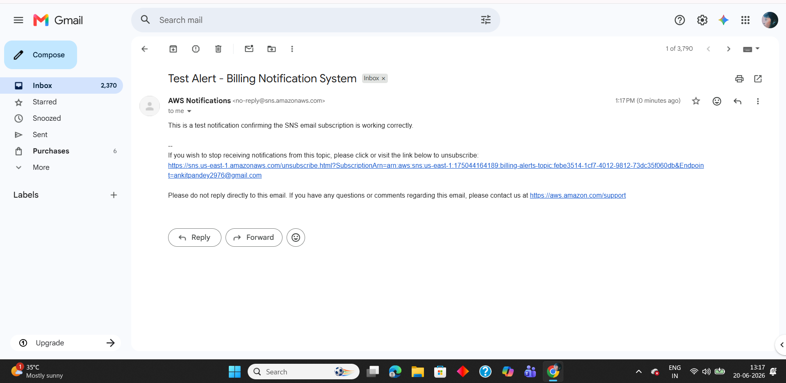

# Cloud Cost Monitoring Dashboard

A serverless cost monitoring and alerting system built on AWS, using CloudWatch billing alarms, SNS email notifications, and a custom dashboard to track spend and resource usage in real time — without any EC2 instances or ongoing infrastructure cost.

---

## 💡 Why I Built This

After deploying my [Automated Website Deployment](https://github.com/Ankit04545/Cloud-Automation-website) project, I wanted to add **operational visibility** on top of it — not just build infrastructure, but also monitor what it costs and how it performs. This project demonstrates:
- Proactive cost control using billing alarms
- Automated email alerting via SNS
- A unified dashboard tracking billing, storage, and traffic metrics
- Zero ongoing cost — no EC2, no NAT Gateway, nothing that accrues charges

---

## 🏗️ Architecture

### Component Description

| Component | Role |
|---|---|
| **CloudWatch** | Collects and stores metrics from billing, S3, and CloudFront |
| **CloudWatch Alarm** | Monitors `EstimatedCharges` and triggers when spend crosses a defined threshold |
| **SNS Topic** | Receives the alarm trigger and fans out the notification |
| **Email Subscription** | Delivers the alert directly to my inbox |
| **CloudWatch Dashboard** | Single-pane view of billing, storage, and traffic metrics |

---

## 📊 Key Results

- 💰 Billing alarm configured to trigger when `EstimatedCharges` exceeds a defined threshold, monitored via CloudWatch
- 📈 Live dashboard tracks 3 real metrics simultaneously: **EstimatedCharges**, **BucketSizeBytes**, and **CloudFront Requests**
- 📦 S3 bucket from Project 1 confirmed at **328 bytes** across **1 object** — verified directly in both S3 console metrics and the CloudWatch dashboard
- 🌐 CloudFront traffic successfully tracked — **Requests metric spiked to 1.75** during a verification visit to the live website
- 📧 Email notification pipeline verified end-to-end via a manual SNS test publish, confirming the subscription is active and correctly configured
- 🆓 Entire system runs at **$0/month** — no EC2, no NAT Gateway, well within AWS Free Tier limits

---

## 🔧 What I Built

### 1. Billing Alarm
- Enabled billing alerts in **Billing Preferences**
- Created a CloudWatch alarm on the `EstimatedCharges` metric (region: US East — N. Virginia, where billing metrics are reported)
- Connected the alarm to an SNS topic for automated notification on breach

### 2. SNS Notification Pipeline
- Created an SNS topic (`billing-alerts-topic`)
- Subscribed my email address and confirmed the subscription
- Verified delivery using a manual test publish rather than waiting for a real billing breach

### 3. CloudWatch Dashboard
- Built a custom dashboard (`my-cloud-monitoring-dashboard`) with 3 widgets:
  - **EstimatedCharges** — total AWS spend
  - **BucketSizeBytes** — storage used by the Project 1 S3 bucket
  - **Requests** — traffic served by the Project 1 CloudFront distribution

---

## 📸 Screenshots

### 1. SNS Topic

### 2. Email Subscription Confirmed

### 3. Billing Alarm Configuration

### 4. CloudWatch Dashboard — Live Metrics

> **Note:** The dashboard is shown over a 2-week window because S3 storage metrics report once every 24 hours, unlike billing and CloudFront metrics which update more frequently. A wider window was needed for all three widgets to display data simultaneously.

### 5. Test Email Received

---

## ⚠️ Challenges Faced

### 1. IAM Billing Permissions
By default, IAM users cannot view billing information even with broad permissions — this is a separate AWS security control. I had to enable **"IAM User and Role Access to Billing Information"** from the root account before granting my IAM user the relevant billing policy.

**Lesson:** Some AWS account-level settings can only be toggled by the root user, regardless of IAM permissions — an important security design AWS enforces deliberately.

### 2. S3 Metrics Not Appearing Immediately
The `BucketSizeBytes` widget initially showed "No data available." I assumed something was misconfigured, but the actual cause was that S3 storage metrics only report **once every 24 hours**, and the default 3-hour dashboard window was too narrow to capture a data point.

**Lesson:** Not all CloudWatch metrics update at the same frequency — billing and S3 storage metrics are daily, while CloudFront and EC2 metrics can be near real-time. Always check a metric's reporting interval before assuming a configuration error.

### 3. Testing Without Waiting for a Real Billing Breach
Waiting for actual AWS spend to cross the alarm threshold could take days. Instead, I used SNS's **Publish Message** feature to manually send a test notification through the same topic the alarm uses — proving the entire notification pipeline works without needing to wait for real billing data to accumulate.

**Lesson:** When testing alerting systems, you can validate the notification channel independently of the triggering condition — a useful technique for faster iteration.

---

## 📚 What I Learned

- How CloudWatch collects and visualises metrics across different AWS services in a single dashboard
- The difference between metric reporting frequency across services (real-time vs daily)
- How SNS implements the publish-subscribe pattern for event-driven notifications
- Why IAM billing access requires a root-level toggle, separate from standard IAM permissions
- How to design a monitoring system that costs nothing by relying only on free-tier-eligible services
- The value of monitoring infrastructure cost proactively rather than discovering charges after the fact

---

## 🚀 How to Replicate This Project

### Prerequisites
- An active AWS account
- IAM user with billing access enabled (via root account)
- An existing AWS resource to monitor (e.g. an S3 bucket or CloudFront distribution)

### Steps
1. Enable billing alerts under **Billing Preferences**
2. Create an SNS topic and subscribe your email
3. Confirm the email subscription
4. Create a CloudWatch alarm on `EstimatedCharges` in the **US East (N. Virginia)** region
5. Connect the alarm to your SNS topic
6. Build a CloudWatch dashboard with widgets for billing, storage, and traffic metrics
7. Test the notification pipeline using SNS's manual publish feature

---

## 👤 Author

**Ankit Pandey**  
AWS Certified Cloud Practitioner | Cisco CCNA Certified  
[GitHub](https://github.com/Ankit04545)